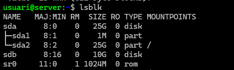
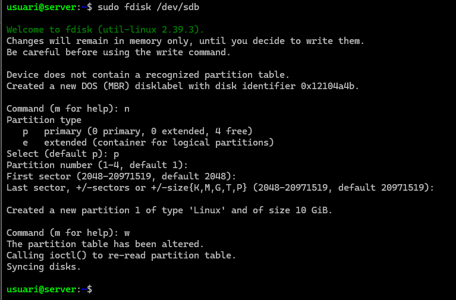
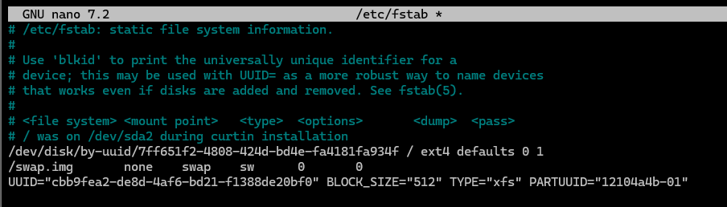
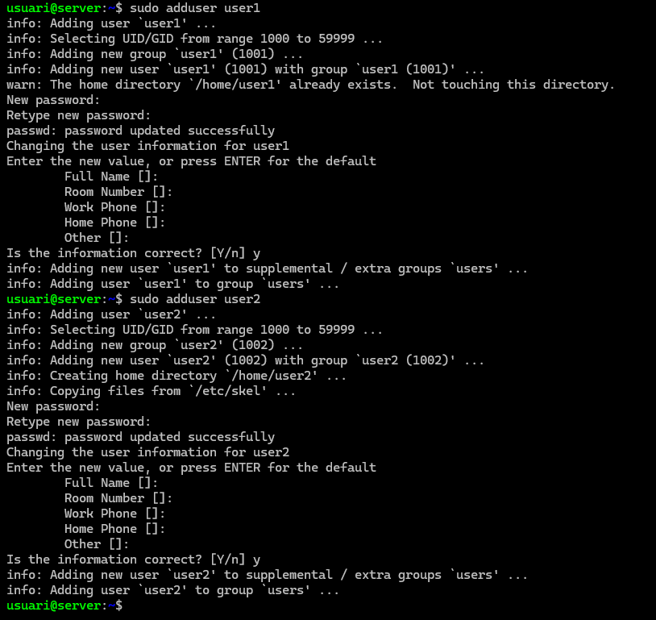
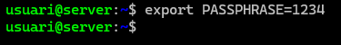
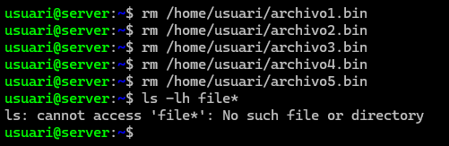
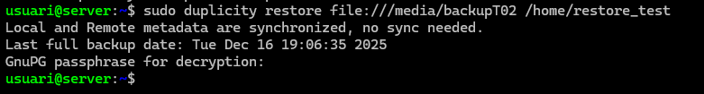

# Guía Técnica: Copia de Seguridad en Servidor Linux con Duplicity

### Introducción

Esta guía explica cómo realizar una copia de seguridad completa del directorio /home en un servidor Linux utilizando Duplicity. Se simula un entorno con un disco adicional de 10 GB para almacenar las copias y se comprueba la restauración.

### Fase 0: Preparación del sistema
### Objetivo

- Crear una máquina virtual con Ubuntu Server.
- Actualizar el sistema operativo.
- Instalar disco de 10GB para la practica


### Pasos
1. Actualizar paquetes
```
sudo apt update
sudo apt upgrade -y
```
### Explicación:

- apt update: actualiza la lista de paquetes disponibles.
- apt upgrade -y: instala las actualizaciones sin pedir confirmación.


### Fase 1: Configuración del disco de backup
### Objetivo

- Preparar el disco adicional de 10 GB.
- Crear punto de montaje y formatear en XFS.

### Pasos
1. Crear carpeta para el montaje


```
sudo mkdir -p /media/backupT02
```
Crea el directorio donde se montará el disco.

2. Verificar discos conectados



```
lsblk
```
Lista los dispositivos de bloque. Identifica el disco adicional (ejemplo: /dev/sdb).

3. Crear partición en el disco



```
sudo fdisk /dev/sdb
```
Dentro de fdisk:

- n: nueva partición.
- p: primaria.
- w: guardar cambios.

4. Formatear la partición en XFS


```
sudo mkfs.xfs -f /dev/sdb1
```
Crea el sistema de archivos XFS en la partición.

5. Verificar UUID


```
sudo blkid /dev/sdb1
```
Obtén el UUID para montaje persistente.

6. Entrar en el archivo
```
/etc/fstab
```



Aqui adjuntamos el UUID de antes y guardamos

7. Montar el disco

```
sudo mount /dev/sdb1 /media/backupT02
```
Monta la partición en la carpeta creada.

### Notas importantes:

Si deseas montaje automático, añade el UUID en /etc/fstab.

### Fase 2: Instalación de Duplicity
### Objetivo

- Instalar la herramienta para realizar copias de seguridad.
### Pasos


```
sudo apt install duplicity -y
```
Instala duplicity y sus dependencias.

### Fase 3: Creación de usuarios y archivos de prueba
### Objetivo

- Crear usuarios adicionales.
- Generar archivos para probar la copia.

### Pasos
1. Crear usuarios



```
sudo adduser user1
```
```
sudo adduser user2
```
Crea usuarios con sus carpetas en /home.

2. Crear archivos de prueba


```
cd /home/usuari
```
```
fallocate -l 10M archivo1.bin
fallocate -l 10M archivo2.bin
fallocate -l 10M archivo3.bin
fallocate -l 10M archivo4.bin
fallocate -l 10M archivo5.bin
```

Genera archivos de 10 MB para simular datos.

### Fase 4: Configuración de la passphrase
### Objetivo
Definir la contraseña para cifrar las copias.
### Pasos



```
export PASSPHRASE=1234
```
Define la variable de entorno para evitar introducir la contraseña manualmente.

### Fase 5: Realización de la copia completa
### Objetivo
Hacer una copia completa del directorio /home.
### Pasos


```
sudo duplicity full /home file:///media/backupT02
```
- Realiza la copia completa en el disco montado.

- Resultado esperado:

- Copia sin errores.
Tamaño aproximado: 50 MB (según archivos creados).


### Fase 6: Restauración de datos
### Objetivo
Comprobar la restauración desde la copia.
### Pasos
1. Eliminar archivos originales



```
rm /home/usuari/archivo1.bin
rm /home/usuari/archivo2.bin
rm /home/usuari/archivo3.bin
rm /home/usuari/archivo4.bin
rm /home/usuari/archivo5.bin
```
2. Restaurar copia



```
sudo duplicity restore file:///media/backupT02 /home/restore_test
```
Restaura los archivos en /home/restore_test.

3. Verificar restauración


```
ls -lh /home/restore_test/usuari
```
Confirma que los archivos se han recuperado correctamente.

### Notas finales

- Desmonta la unidad al finalizar:
```
sudo umount /media/backupT02
```

- La variable PASSPHRASE debe definirse antes de cada operación.
