# Guía: Conexión Cliente-Servidor Ubuntu–Windows con SSH, Proxy y Análisis de Tráfico

## Introducción
En esta práctica se configurarán dos máquinas virtuales en VirtualBox:

- **Servidor:** Ubuntu  
- **Cliente:** Windows  

El objetivo es establecer comunicación entre ambas mediante **SSH**, implementar un **proxy Squid** en el servidor y analizar el tráfico con **Wireshark**.  
Todo se realizará mediante comandos para comprender el funcionamiento interno de la red y los servicios.

---

## Estructura de la guía

### 1. Configuración de red en VirtualBox
- Adaptadores: **NAT + Adaptador en modo Anfitrión** en ambas máquinas.
- Verificación de conectividad entre cliente y servidor.

### 2. Instalación y configuración del servicio SSH en Ubuntu
- Instalación de **openssh-server**.
- Verificación del servicio y apertura del puerto correspondiente.

### 3. Conexión desde Windows al servidor Ubuntu mediante SSH
- Uso del comando `ssh` desde **PowerShell** o **CMD**.
- Prueba de autenticación.

### 4. Instalación y configuración del proxy (Squid) en Ubuntu
- Instalación de **Squid**.
- Configuración básica para permitir tráfico del cliente.
- Verificación del funcionamiento del proxy.

### 5. Captura y análisis del tráfico con Wireshark
- Instalación de Wireshark en ambas máquinas (o al menos en una).
- Uso de filtros para visualizar tráfico

---

##Preparacion de las maquinas y sus adaptadores
Crearemos e instalaremos las maquinas en nuestro equipo teniendo en cuenta esto:

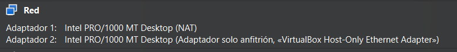

Tanto el servidor como el cliente seran configurados con los 2 adaptadores que usaremos para esta practica, los cuales son `NAT` y `Anfitrion`.

Indice:


....

Una vez las maquinas  estan instaladas iniciaremos con el server

## Paso 1: Actualización del sistema en el servidor Ubuntu

### Introducción
Antes de instalar cualquier servicio, es fundamental asegurarse de que el sistema esté actualizado.  
Esto garantiza que todos los paquetes y dependencias estén en su versión más reciente, reduciendo problemas de compatibilidad y seguridad.

---

## Instrucciones detalladas

### 1. Accede al servidor Ubuntu
Inicia sesión en la máquina virtual Ubuntu desde la consola.

### 2. Actualiza la lista de paquetes disponibles y actualizaciones en general
Ejecuta el siguiente comando:

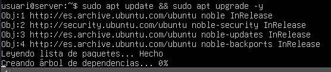

```
sudo apt update && sudo apt upgrade -y
```

Explicación:
Este comando sincroniza la lista de paquetes locales con los repositorios oficiales, mostrando si hay actualizaciones disponibles.

## Notas importantes

- Asegúrate de tener conexión a Internet en la máquina Ubuntu antes de ejecutar estos comandos.
- Si el sistema pide reinicio después de la actualización, usa:
```
sudo reboot
```

---

## Paso 2: Configuración de Netplan para habilitar DHCP en ambos adaptadores

### Introducción:
En este paso configuraremos la red del servidor Ubuntu para que ambos adaptadores (NAT y Adaptador en modo Anfitrión) utilicen DHCP. Esto permitirá que cada interfaz obtenga automáticamente una dirección IP, facilitando la conectividad tanto con Internet como con la red interna entre cliente y servidor.

---

## Instrucciones detalladas

### 1. Identificar las interfaces de red
Ejecuta:
```
ip a
```
Explicación:
Este comando lista todas las interfaces de red. Normalmente verás algo como enp0s3 (NAT) y enp0s8 (Anfitrión).

### 2. Editar el archivo de configuración de Netplan con nano
El archivo suele estar en:
```
sudo nano /etc/netplan/50-cloud-init.yaml
```
Explicación:
Aquí definiremos que ambas interfaces usen DHCP.

### 3. Configurar el YAML para DHCP en ambas interfaces
Sustituye el contenido para dejarlo asi:

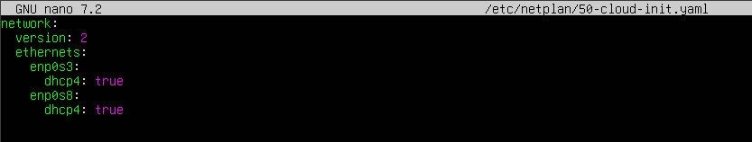

Explicación:
enp0s3 → interfaz NAT (acceso a Internet).
enp0s8 → interfaz en modo anfitrión (comunicación interna).
dhcp4: true → habilita DHCP para IPv4.

### 4. Aplicar los cambios
Ejecuta:
```
sudo netplan apply
```
Explicación:
Aplica la nueva configuración de red.

### 5. Verificar las direcciones IP asignadas
Ejecuta:
```
ip a
```

Explicación:
Comprueba que cada interfaz tiene una IP distinta (una del rango NAT y otra del rango anfitrión).

## Notas importantes

- Respeta la indentación en el archivo YAML (espacios, no tabuladores).
- Si el archivo no se llama `50-cloud-init.yaml`, puede ser `01-netcfg.yaml` u otro. Verifica con:
```
ls /etc/netplan/
```

OJO: Si no se asignan IPs, reinicia la máquina:
```
sudo reboot
```

---

## Paso 3: Instalación y configuración del servicio SSH en Ubuntu

### Introducción:
El servicio SSH (Secure Shell) permite la conexión remota segura entre sistemas. En este paso instalaremos el servidor SSH en Ubuntu para que el cliente Windows pueda conectarse mediante comandos.

---

### 1. Instalar el servidor SSH
Ejecuta:

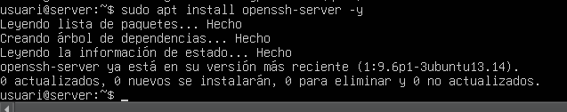

```
sudo apt install openssh-server -y
```
Explicación:
Instala el paquete openssh-server que habilita el servicio SSH en Ubuntu. El parámetro -y acepta automáticamente la instalación.

### 2. Verificar que el servicio está activo
Ejecuta:

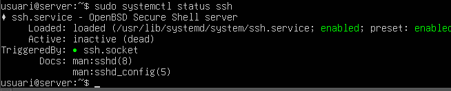

```
sudo systemctl status ssh
```
Explicación:
Muestra el estado del servicio SSH. Debe aparecer como active (running).

## Notas importantes

- Si el firewall está activo, asegúrate de permitir el puerto 22:
```
sudo ufw allow ssh
```
- Si el servicio no arranca, revisa el archivo de configuración:
```
sudo nano /etc/ssh/sshd_config
```
y asegúrate de que Port 22 esté habilitado.

---

## Paso 4: Conexión SSH desde Windows al servidor Ubuntu y prueba con usuario root

### Introducción:
En este paso verificaremos la IP del servidor Ubuntu, nos conectaremos desde el cliente Windows mediante SSH usando un usuario normal, y luego realizaremos una prueba intentando conectarnos como root para comprobar la restricción de acceso directo (por seguridad, SSH no permite login root por defecto).

---

## Instrucciones detalladas

### 1. Obtener la IP del servidor Ubuntu
En la terminal del servidor, ejecuta:
```
ip a
```
Explicación:
Este comando muestra todas las interfaces y sus direcciones IP.

Busca la IP asignada a la interfaz enp0s8 (modo anfitrión), normalmente algo como 192.168.56.x.

### 2. Conectarse desde Windows al servidor Ubuntu usando SSH
En el cliente Windows, abre PowerShell y ejecuta:
```
ssh usuari@192.168.56.105
```
Explicación:
Sustituye usuario por el nombre del usuario creado en Ubuntu y 192.168.56.x por la IP obtenida.

- Si es la primera vez, pedirá confirmar la clave del host (escribe yes).
- Luego pedirá la contraseña del usuario.

### 3. Asignar contraseña al usuario root en Ubuntu
Una vez dentro del servidor (desde Windows), ejecuta:
```
sudo passwd root
```
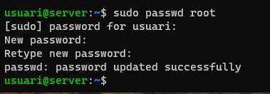

Explicación:
Este comando permite establecer una contraseña para el usuario root.
Introduce la nueva contraseña dos veces.

### 4. Cerrar la sesión SSH actual
Para salir del servidor, escribe:
```
exit
```
Explicación:
Regresas a la terminal de Windows.

### 5. Intentar conectarse como root (debe fallar)
En PowerShell, ejecuta:

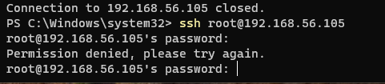

```
ssh root@192.168.56.105
```
Explicación:
Introduce la contraseña que configuraste para root.

Resultado esperado: El acceso será rechazado. Esto es correcto porque, por defecto, SSH no permite login directo como root por motivos de seguridad.

## Notas importantes

- El error al intentar conectar como root es normal y deseado.
- Si quieres permitir login root (solo para pruebas), habría que editar `/etc/ssh/sshd_config` y cambiar `PermitRootLogin` no a `yes`, pero `NO es recomendable en entornos reales`.

---

## Paso 5: Configuración del archivo sshd_config para modificar parámetros de SSH

### Introducción:
En este paso editaremos el archivo de configuración principal del servicio SSH (/etc/ssh/sshd_config) en el servidor Ubuntu. Este archivo controla aspectos críticos como la autenticación, el puerto, y si se permite el acceso directo como root. Es importante hacerlo con cuidado porque cualquier error puede impedir conexiones SSH.

---

## Instrucciones detalladas

1. Abrir el archivo sshd_config con privilegios de administrador
Ejecuta:
```
sudo nano /etc/ssh/sshd_config
```
Explicación:
Usamos nano para editar el archivo. Puedes usar otro editor si prefieres (vi, vim).

### 2. Localizar y modificar las siguientes directivas
Según la imagen a mostrar, normalmente se ajustan estas líneas:

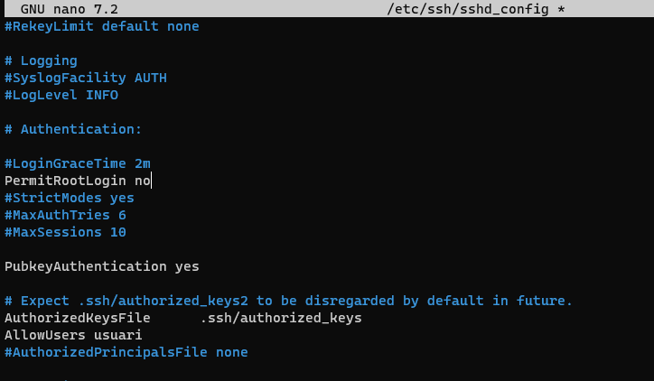

### Explicación de las líneas configuradas

. `PermitRootLogin no`

- Función: Indica que NO se permite el acceso SSH directo con el usuario root.
- Motivo: Es una medida de seguridad crítica. Si se permitiera el acceso root por SSH, cualquier atacante que obtenga la contraseña tendría control total del sistema.
- Resultado: Aunque root tenga contraseña, no podrá iniciar sesión por SSH.

. `PubkeyAuthentication yes`

- Función: Habilita la autenticación mediante claves públicas.
- Motivo: Es más seguro que usar contraseñas, ya que evita ataques por fuerza bruta y robo de credenciales.
- Resultado: Permite que los usuarios que tengan su clave pública en el servidor se conecten sin contraseña.

. `AuthorizedKeysFile .ssh/authorized_keys`

- Función: Define la ubicación del archivo donde se almacenan las claves públicas autorizadas para cada usuario.
- Motivo: SSH necesita saber dónde buscar las claves para validar la autenticación.
- Resultado: Cada usuario tendrá un archivo ~/.ssh/authorized_keys con las claves permitidas.

. `AllowUsers usuari`

- Función: Restringe el acceso SSH únicamente al usuario especificado (usuari).
- Motivo: Limitar el acceso reduce la superficie de ataque. Solo el usuario indicado podrá conectarse por SSH.
- Resultado: Si intentas conectarte con otro usuario (incluido root), el acceso será denegado.

### 3. Guardar los cambios y salir
En nano, pulsa:
- CTRL + O   (guardar)
- ENTER      (confirmar)
- CTRL + X   (salir)

### 4. Reiniciar el servicio SSH para aplicar cambios
Ejecuta:

```
sudo systemctl restart ssh
```
Explicación:
Reinicia el servicio para que los cambios surtan efecto.

## Notas importantes

- Permitir login root es un riesgo de seguridad. Hazlo solo en entornos de laboratorio.
- Si cometes errores en el archivo, SSH puede fallar. Antes de cerrar sesión, prueba la conexión en otra terminal.
- Haz copia de seguridad del archivo antes de editar:
```
sudo cp /etc/ssh/sshd_config /etc/ssh/sshd_config.bak
```

---

## Paso 6: Generar claves SSH en el cliente Windows y copiar la clave pública

### Introducción:
En este paso crearemos un par de claves SSH en el cliente Windows para autenticación sin contraseña. Luego mostraremos la clave pública y la copiaremos para usarla en el servidor Ubuntu.

### Instrucciones detalladas

### 1. Abrir PowerShell en el cliente Windows
Asegúrate de tener el cliente OpenSSH instalado (Windows 10/11 lo incluye por defecto).

### 2. Generar el par de claves SSH
Ejecuta

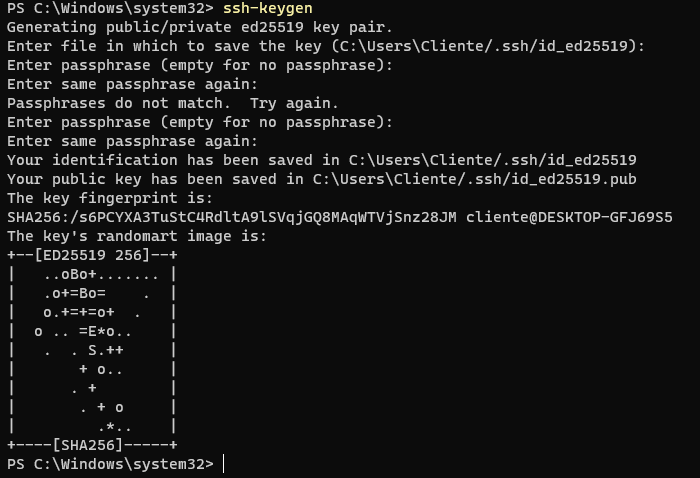

```
ssh-keygenMostrar 
```
Explicación:

Este comando crea un par de claves: privada (id_rsa) y pública (id_rsa.pub).
Cuando pregunte por la ubicación, pulsa ENTER para aceptar la ruta por defecto (C:\Users\tu_usuario\.ssh\).
Cuando pregunte por passphrase, pulsa ENTER (sin contraseña adicional).

### 3. Verificar el tipo de clave (opcional)
Puedes comprobar el tipo con:

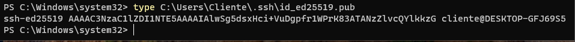

```
type $env:USERPROFILE\.ssh\id_rsa.pub
```
Explicación:

type muestra el contenido del archivo.
El archivo id_rsa.pub contiene la clave pública que debemos copiar.

### 4. Copiar la clave pública
Selecciona todo el contenido que aparece (empieza por ssh-rsa y termina con tu nombre de usuario) y copealo.

## Notas importantes

- Nunca compartas la clave privada (id_rsa), solo la pública (id_rsa.pub).
- Si no existe la carpeta .ssh, el comando ssh-keygen la creará automáticamente.

---

## Paso 7: Crear el directorio .ssh y configurar authorized_keys en el servidor

### Introducción:
Este paso consiste en preparar el servidor Ubuntu para aceptar autenticación mediante clave pública. Crearemos el directorio .ssh, pegaremos la clave pública del cliente en el archivo authorized_keys y ajustaremos los permisos para garantizar la seguridad.

##Instrucciones detalladas

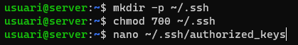

### 1. Crear el directorio .ssh en el home del usuario
```
mkdir -p ~/.ssh
```
Explicación:
Crea el directorio .ssh si no existe. El parámetro -p evita errores si ya está creado.

### 2. Asignar permisos seguros al directorio .ssh
```
chmod 700 ~/.ssh
```
Explicación:
Permite acceso solo al propietario (lectura, escritura, ejecución). Es obligatorio para que SSH acepte las claves.

### 3. Crear y editar el archivo authorized_keys
```
nano ~/.ssh/authorized_keys
```
Explicación:
Abre el archivo donde se almacenarán las claves públicas autorizadas.

### 4. Pega aquí la clave pública copiada del cliente Windows (la que empieza por ssh-rsa).

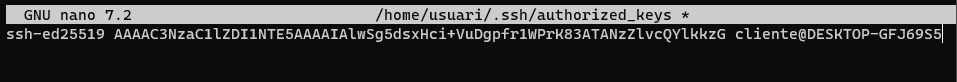

Guarda y cierra (CTRL+O, ENTER, CTRL+X).

### 5. Asignar permisos seguros al archivo authorized_keys
```
chmod 600 ~/.ssh/authorized_keys
```
Explicación:
Solo el propietario puede leer y escribir el archivo. SSH exige estos permisos para funcionar.

### 6. Asegurar la propiedad del directorio y archivos
```
chown -R usuari:usuari ~/.ssh
```
Explicación:
Cambia el propietario y grupo del directorio .ssh y su contenido al usuario correcto (usuari).

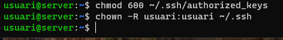

## Notas importantes

- Si los permisos no son correctos, la autenticación por clave fallará.
- Nunca compartas la clave privada del cliente, solo la pública.
- Verifica que el usuario en el servidor coincide con el que usas para conectarte.
