# Guía: Configuración de Servidor CUPS y Cliente en Red Virtual

### Introducción
En esta guía aprenderás a configurar un servidor de impresión con CUPS en Ubuntu Server y conectarlo desde un cliente Zorin OS, utilizando adaptadores NAT y Anfitrión en una red virtual. Esto permitirá compartir impresoras en entornos controlados.

### Objetivo

- Configurar el servidor Ubuntu con CUPS y una impresora virtual.
- Permitir la administración vía interfaz web.
- Conectar el cliente Zorin OS al servidor y realizar pruebas de impresión.
- Verificar la correcta generación de archivos PDF.


## FASE 0: Configuración de Red
Antes de comenzar:

Ambas máquinas deben tener adaptadores NAT y Anfitrión.
Asignar IPs estáticas o con DHCP:

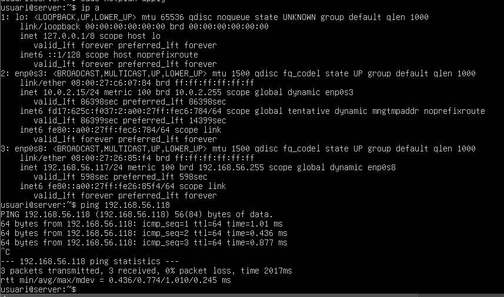

Servidor Ubuntu: `192.168.56.117`
Cliente Zorin: `192.168.56.118`

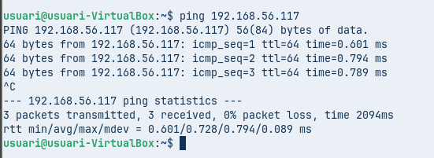

## FASE 1: Configuración en el Servidor (Ubuntu Server)

### 1. Actualizar repositorios
```
sudo apt update
```
Explicación:

sudo: Ejecuta el comando con privilegios de administrador.
apt update: Actualiza la lista de paquetes disponibles en los repositorios.


### 2. Instalar CUPS

```
sudo apt install cups -y
```

Explicación:

Instala el servicio CUPS (Common Unix Printing System).
-y: Acepta automáticamente la instalación.

Verifica que el servicio está activo:

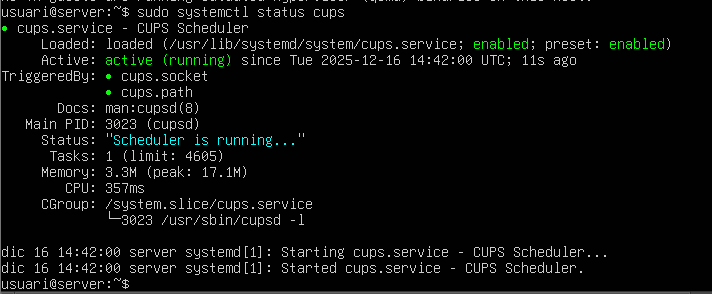

```
systemctl status cups
```

### 3. Instalar la impresora virtual CUPS-PDF

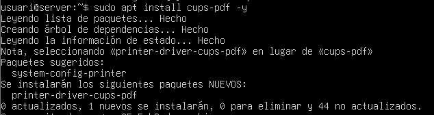

```
sudo apt install cups-pdf -y
```

Explicación:

Añade soporte para generar impresiones en formato PDF.


### 4. Crear usuario y añadirlo al grupo lpadmin

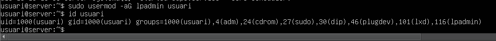

```
sudo usermod -aG lpadmin usuar
```
```
id usuari
```
Explicación:

usermod -aG lpadmin: Añade el usuario al grupo de administración de impresoras.
id usuari: Comprueba los grupos del usuario.


### 5. Editar configuración de CUPS

Abrir el archivo:

```
sudo nano /etc/cups/cupsd.conf
```
Asegúrate de incluir:

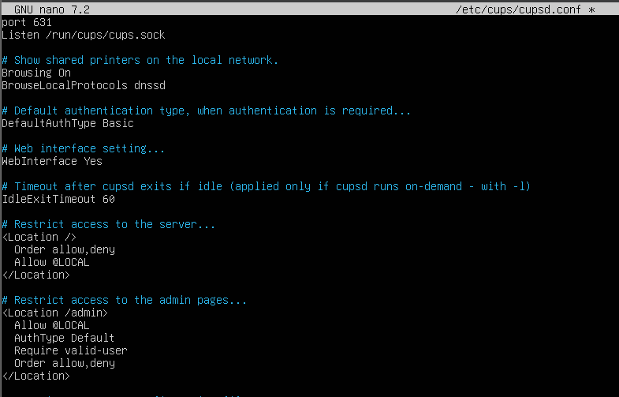

Explicación:

Permite acceso desde la red local y habilita la interfaz web.

Guardar y salir: Ctrl+O, Enter, Ctrl+X.

### 6. Reiniciar CUPS

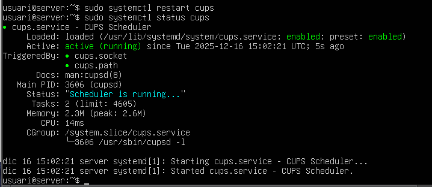

```
sudo systemctl restart cups
```

✅ Servidor listo.

## FASE 2: Configuración en el Cliente (Zorin OS)

### 7. Acceder al panel web de CUPS

En el navegador:

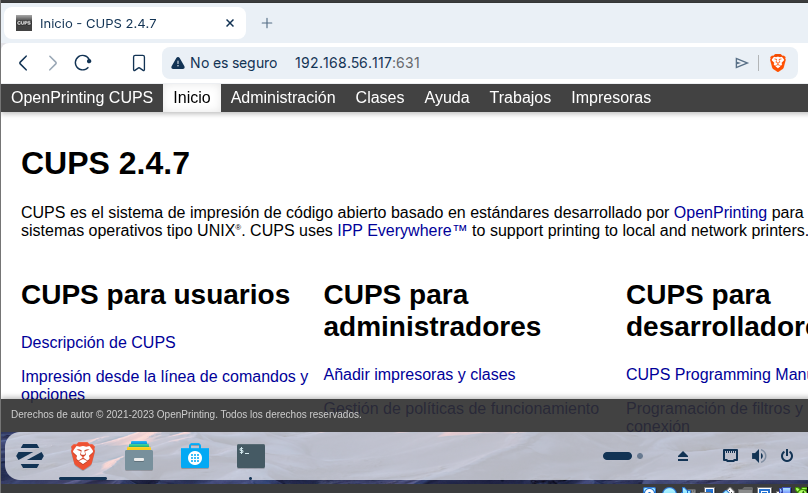

```
http://192.168.56.117:631
```

### 8. Iniciar sesión y añadir impresora

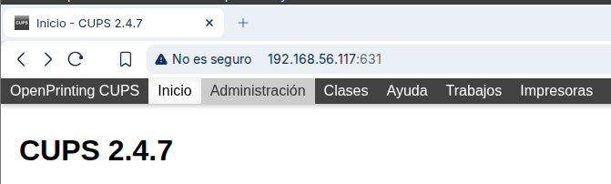
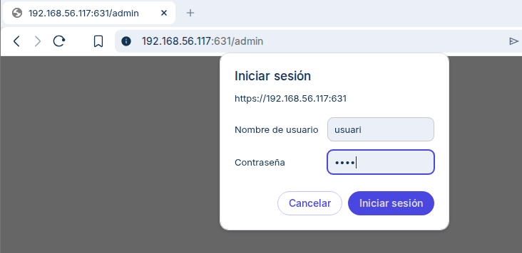

Administración → Añadir impresora.

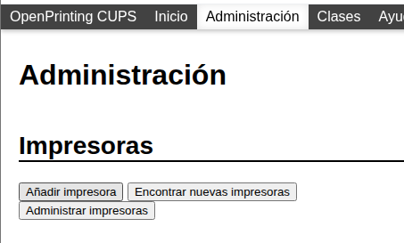

Usuario: usuari (del servidor).


Selecciona CUPS-PDF.


### 9. Configurar la impresora

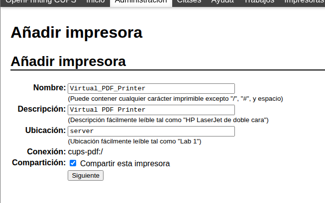

Nombre: CUPS-PDF
Ubicación: Servidor Ubuntu
Compartir impresora: ✅

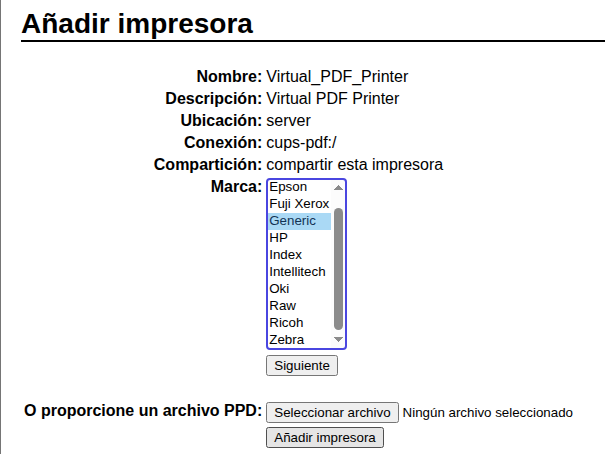


Marca y modelo: Generic → Generic PostScript Printer


### 10. Verificar en Zorin

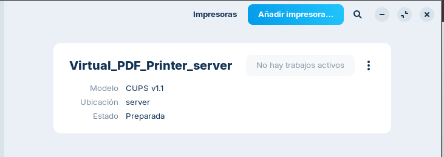

Configuración → Impresoras.
Imprimir prueba:

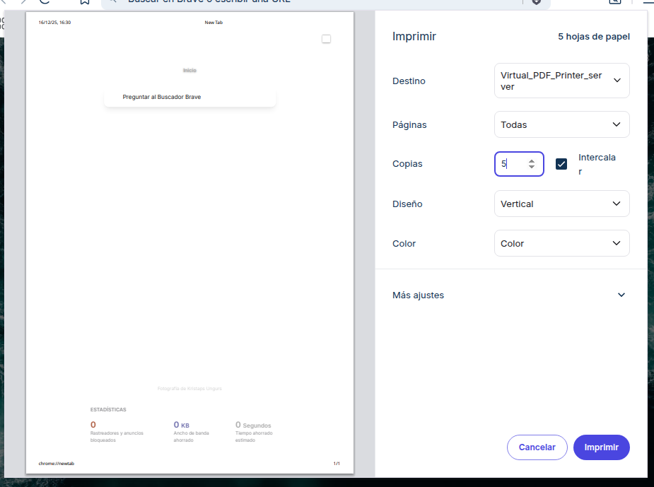

Abrir documento → Ctrl+P → Seleccionar CUPS-PDF → Imprimir.


## FASE 3: Comprobación Final

### 11. Ver trabajos en la interfaz web

En el cliente:
```
http://192.168.56.117:631/jobs
```
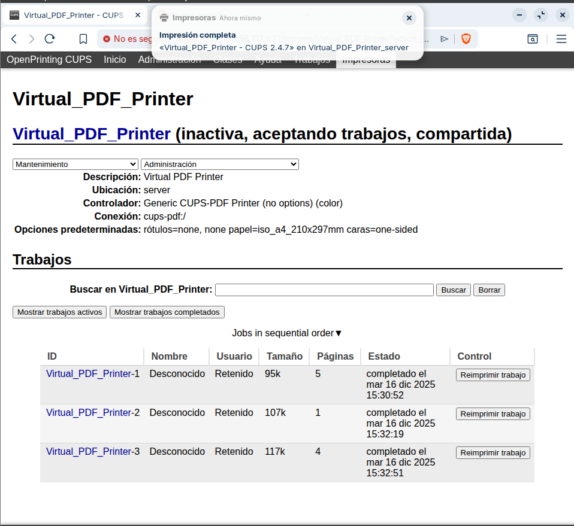

### 12. Ver PDFs en el servidor

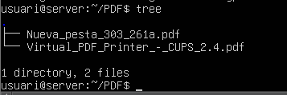

Por defecto:
```
/home/usuari/PDF/
```
Para ver estructura:
```
cd /home/usuari/PDF/cd
```
Instalar tree si no está:
```
sudo apt install tree
```
## Notas importantes

- Asegúrate de que ambos sistemas están en la misma red virtual.
- El firewall debe permitir el puerto 631.
- Usa credenciales seguras para el usuario administrador.
